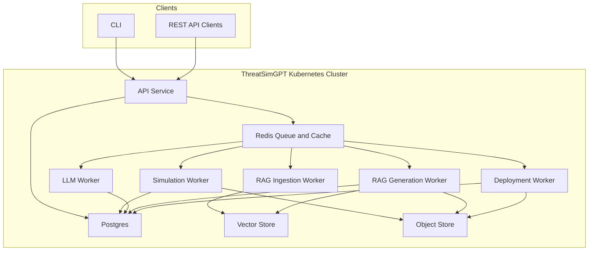

# Deployment Diagram

```mermaid
graph TD
  subgraph Clients
    C1[CLI]
    C2[REST API Clients]
  end

  subgraph Cluster[ThreatSimGPT Kubernetes Cluster]
    API[API Service]
    Q[Redis Queue and Cache]
    PG[Postgres]
    VS[Vector Store]
    OBJ[Object Store]

    W1[Simulation Worker]
    W2[LLM Worker]
    W3[RAG Ingestion Worker]
    W4[RAG Generation Worker]
    W5[Deployment Worker]
  end

  C1 --> API
  C2 --> API

  API --> Q
  API --> PG

  Q --> W1
  Q --> W2
  Q --> W3
  Q --> W4
  Q --> W5

  W1 --> PG
  W2 --> PG
  W3 --> VS
  W4 --> VS
  W4 --> PG
  W5 --> PG

  W1 --> OBJ
  W4 --> OBJ
  W5 --> OBJ
```
